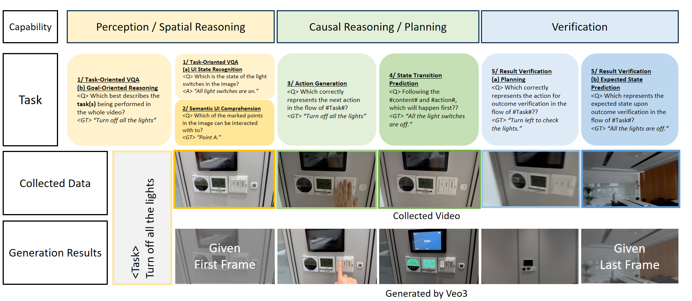

# SWITCH: Benchmarking Modeling and Handling of Tangible Interfaces in Long-horizon Embodied Scenarios

<div align="center">



</div>

An overview of theSWITCHbenchmark, using the case \``Turn off all the lights\'' as a running example. SWITCH covers the collection and annotation of real-world TCI interaction data (``Collected Data''), which we systematically structure into five distinct tasks. These tasks are designed to evaluate models across three crucial capability dimensions: Perception/Spatial Reasoning, Causal Reasoning/Planning, and Verification. Furthermore, we leverage the benchmark to evaluate advanced generative models, like Veo3. By comparing generated videos against ground truth, we illustrate how current models still exhibit significant room for improvement in logical consistency and fine-grained interaction for real-word use, thus underscoring the importance of SWITCH's target scenarios.

## Key Tasks

- **Task-Aware Visual Question Answering (VQA):**: defines a task-aware VQA setting composed of two complementary sub-tasks: (a) UI State Recognition: assessing whether the model can recognize and describe the current state of TCI elements within the scene; and (b) Goal-Oriented Reasoning: testing whether the model can interpret the purpose and outcome of actions observed in dynamic video sequences, reasoning about whether these interactions successfully achieve the intended task goals. Together, these sub-tasks measure a model’s ability to ground semantics in visual context, comprehend high-level task objectives, and reason about the operational consistency between actions and outcomes.

- **Semantic UI Comprehension**: tests whether a model can accurately localize and interpret actionable UI elements in cluttered or dynamic settings, reasoning about their spatial and functional relationships while inferring human intent. 

- **Action Generation**: evaluates a model’s ability to infer intent and plan executable, context-aware action sequences that achieve user objectives. (a) UI Action Identification: Detect the relevant interaction region, recognize its affordances, and predict the appropriate mode of interaction; (b) Action Execution Planning: Generate the necessary physical actions to perform the intended TCI operation, such as moving toward the interface or manipulating its components.

- **State Transition Prediction**: evaluates a model’s capacity for causal reasoning, short-term prediction, and fine-grained understanding of action–state dynamics in interactive environments. (a) UI-State Transition: Predict changes in the visual or functional state of TCI elements after an action (e.g., switch toggled, button activated). (b) Environment-State Transition: Predict corresponding updates in the surrounding physical or visual environment (e.g., lights turning on, revealing a new scene or perspective).
(c) Coupled Transition: Reason about interdependent updates where TCI and environment states jointly change as part of the same causal event (e.g., pressing a control panel triggers a screen update and changes ambient light level).

- **Result Verification**: (a)  Verification Planning: Test whether the model can infer what actions or checks are required to verify the outcome of a previous operation, such as observing key indicators, querying system feedback, or performing follow-up interactions. (b) Expected State Prediction: Assess whether the model can predict what the expected state should look like after a successful interaction, providing a causal grounding for evaluating success or failure.

## Benchmark Highlights


## Getting Started

Will update soon!

## Citation

If you use SWITCH in your research, please cite:

```bibtex
@benchmark{switch2025,
  title={SWITCH: Benchmarking Modeling and Handling of Tangible Interfaces in Long-horizon Embodied Scenarios},
  year={2025}
}
```

## Contributing

We welcome contributions and feedback! Please feel free to submit issues or pull requests.

## License

This project is licensed under the MIT License - see the LICENSE file for details.

## Contact

For questions or inquiries, please reach out to the BAAI-Agents team.